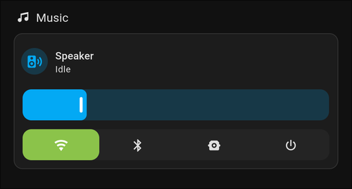

# Kef Speaker Sources Tile Feature

Easily switch between your KEF speaker’s input sources—Bluetooth, Optical, AUX, and more—right from your Home Assistant dashboard.

## Preview



## Configure

```yaml
type: grid
cards:
  - type: heading
    heading: Music
    heading_style: title
    icon: mdi:music
  - features:
      - type: media-player-volume-slider
      - type: custom:media-player-kef-source-feature
        source_list:
          - wifi
          - bluetooth
          - optical
    type: tile
    entity: media_player.entity_id
    grid_options:
      columns: 12
      rows: 2
    name: Speaker
```
